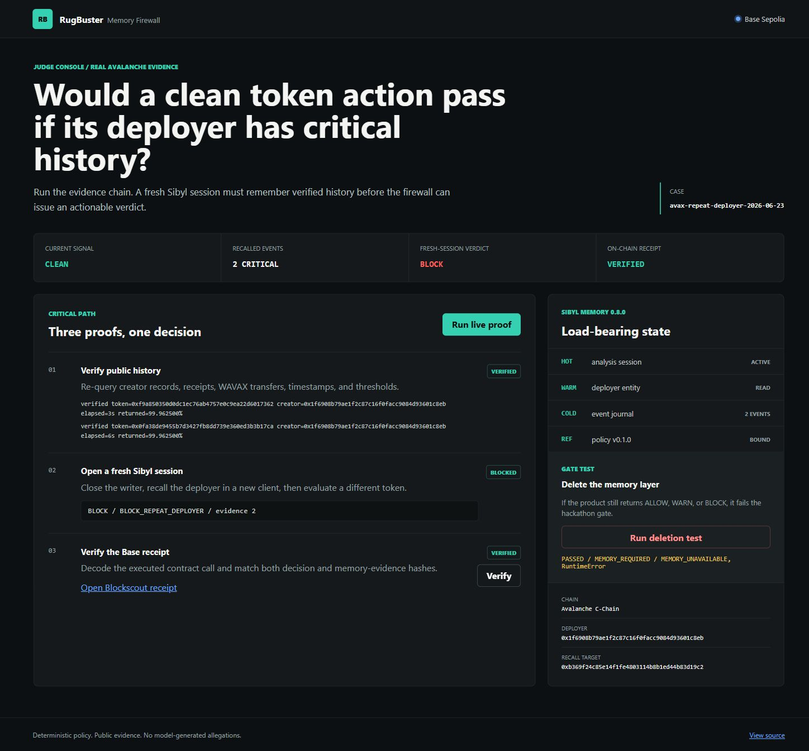
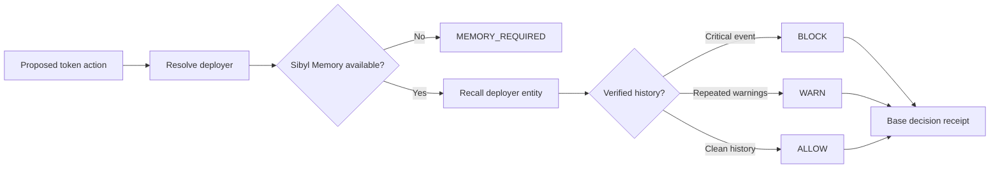

# RugBuster Memory Firewall

[](https://github.com/rugbusteraipatrol/rugbuster-memory-firewall/actions/workflows/ci.yml)
[](https://github.com/Sibyl-Labs/Sibyl-Memory)
[](https://base-sepolia.blockscout.com/address/0x5F30276B3A5079E088Ec3072884286de5a868355?tab=contract)
[](LICENSE)

**A pre-sign safety agent that blocks actions a stateless scanner would miss.**

A token can look clean now while its deployer has harmful verified history on
other contracts. RugBuster resolves the deployer, recalls that history from a
fresh Sibyl Memory session, changes the decision, and anchors the resulting
receipt on Base Sepolia.

> **The load-bearing moment:** current token signals are clean, but a fresh
> session recalls two verified critical events for the same deployer and returns
> `BLOCK_REPEAT_DEPLOYER`. Delete Sibyl Memory and no actionable verdict can be
> produced: the result is `MEMORY_REQUIRED`.

**For judges:** [90-second verification path](JUDGE-GUIDE.md) | [demo script](docs/DEMO-SCRIPT.md) | [rubric evidence](docs/RUBRIC-MATRIX.md)



## Judge Console

Run the visual proof console:

```bash
.venv/bin/python -m uvicorn rugbuster_memory_firewall.demo:app --port 8787
```

On Windows use `.venv\Scripts\python` in place of `.venv/bin/python`, then
open `http://127.0.0.1:8787`. The console runs the real live verifier, the
memory-deletion gate, and public Base receipt verification from three explicit
controls.

## Verified result

| Claim | Public or reproducible proof |
| --- | --- |
| One deployer created the two historical tokens and the recall target | [Evidence artifact](evidence/avax-repeat-deployer-case.json) plus live Routescan verification |
| Each historical pool received 50 WAVAX and returned 49.981250056079839479 WAVAX within 3 or 6 seconds | [Live verifier](scripts/verify_real_case.py) re-queries Avalanche RPC instead of trusting the artifact |
| A fresh Sibyl client changes a clean-current-signal decision to `BLOCK` | [Fresh-session test](tests/test_sibyl_sdk.py#L55) and live verifier output |
| Removing memory prevents an actionable verdict | [Deletion test](tests/test_sibyl_sdk.py#L109) returns `MEMORY_REQUIRED` |
| A real decision is anchored on Base Sepolia and a fresh run recalls the same evidence | [Decision transaction](https://base-sepolia.blockscout.com/tx/0x13fdde4a65e27ad8dbe3843439f965eb0293dd630d0884e3b56c62eb43412eca), [machine-readable receipt](evidence/base-sepolia-decision-receipt.json), and the console's live memory-hash comparison |

No token name, scanner label, or wallet owner is treated as proof of fraud.
Policy decisions rely on addresses, transaction receipts, transfer directions,
amounts, timestamps, and explicit thresholds.

## Product flow



The gate is deterministic. An LLM cannot override it, and an unavailable
resolver or memory layer fails closed.

## Why memory is load-bearing

Every actionable decision follows this critical path:

1. The API independently resolves the token deployer in
   [`api.py`](src/rugbuster_memory_firewall/api.py#L95).
2. `pre_sign()` writes HOT analysis state and REFERENCE policy state, then
   performs the mandatory WARM entity read in
   [`firewall.py`](src/rugbuster_memory_firewall/firewall.py#L219).
3. Recalled COLD-backed observations change the verdict in
   [`firewall.py`](src/rugbuster_memory_firewall/firewall.py#L260).
4. Any memory failure returns only `MEMORY_REQUIRED` in
   [`firewall.py`](src/rugbuster_memory_firewall/firewall.py#L302).

The four Sibyl tiers do real work:

| Tier | Persisted state | Decision role |
| --- | --- | --- |
| HOT | Current analysis and completion state | Tracks the in-flight session and resulting decision hash |
| WARM | Deployer entity with deduplicated verified observations | Supplies the history used by policy thresholds |
| COLD | Append-only observation and decision journal | Preserves event order and audit context |
| REFERENCE | Versioned policy thresholds | Binds recall to the exact policy version |

Without Sibyl Memory, RugBuster can still resolve a deployer and inspect current
signals, but it cannot make the product's claimed history-aware decision. That
is enforced in code and tested, not left to presentation.

### How memory made this possible

The recall target has clean current signals, so its actionable `BLOCK` cannot
come from the current scan. Sibyl carries independently verified observations
from two earlier contracts into a genuinely fresh client session and supplies
the evidence used by the deterministic policy. Removing that recall path leaves
the firewall without enough context to decide and forces `MEMORY_REQUIRED`.

## Reproduce it

Requirements: Python 3.12 and Node.js 22+.

```bash
# Windows
py -3.12 -m venv .venv
.venv\Scripts\python -m pip install -e ".[dev]"

# macOS / Linux (where python3.12 is installed)
python3.12 -m venv .venv
.venv/bin/python -m pip install -e ".[dev]"

# All platforms
npm ci
```

The package intentionally requires Python 3.12; Python 3.13 is not part of the
verified hackathon environment.

Run the deterministic judge suite:

```bash
# Windows
.venv\Scripts\python scripts\judge_check.py

# macOS / Linux
.venv/bin/python scripts/judge_check.py
```

Add `--live` to re-query Routescan and Avalanche RPC and reproduce the real
cross-session case. The live path requires network access but no paid API key.

```bash
.venv/bin/python scripts/judge_check.py --live
```

Expected high-signal output:

```text
26 passed
4 passing
deletion_gate=PASSED verdict=MEMORY_REQUIRED
fresh_session_decision={"verdict":"BLOCK","reason_codes":["BLOCK_REPEAT_DEPLOYER"],"evidence_count":2,...}
```

## Pre-sign API

```bash
export RUGBUSTER_MEMORY_DB=./runtime-memory.db
.venv/bin/python -m uvicorn rugbuster_memory_firewall.api:create_app \
  --factory --host 127.0.0.1 --port 8765
```

Open `http://127.0.0.1:8765/docs`. `POST /v1/pre-sign` accepts a chain, token
address, current risk, proposed action, and session ID. A caller-supplied
deployer is optional, but it must match independent resolution when supplied.

Supported identity resolution:

- Avalanche: Routescan contract-creation record.
- Solana: top-level creator from a RugCheck full report.

The response contains the verdict, stable reason codes, recalled history,
resolver provenance, action hash, memory-evidence hash, decision hash, policy
version, and optional Base receipt URL.

### Paid x402 agent endpoint

`POST /v1/x402/pre-sign` exposes the same memory-backed decision as an x402 v2
resource. In production it charges `$0.01` USDC on Base mainnet through the
Coinbase CDP facilitator. The free route remains available for reproducible
judging; the paid route proves that another agent can purchase the decision as
a service.

Configuration is documented in [`.env.example`](.env.example). With x402
enabled, `GET /.well-known/x402` publishes the route, price, network, payee,
and resource URL. An append-only runtime log records successful payment
transactions together with the response's decision and memory-evidence hashes,
without storing payment signatures or credentials. See the
[independent pilot checklist](docs/X402-PILOT.md).

The provided Docker image seeds only the committed Avalanche case used by the
judge demo. The case can be re-queried from public chain data with
`scripts/judge_check.py --live`; seeding it twice does not duplicate its two
observations. A persistent `/data` volume keeps both Sibyl Memory and settlement
records across deploys.

## Base integration

[`DecisionReceiptRegistry.sol`](contracts/DecisionReceiptRegistry.sol) records
an immutable receipt containing the decision hash, memory-evidence hash,
`ALLOW`/`WARN`/`BLOCK` verdict, submitter, block timestamp, and policy version.
A decision hash cannot be overwritten.

- Network: Base Sepolia (`84532`)
- Contract: [`0x5F30276B3A5079E088Ec3072884286de5a868355`](https://base-sepolia.blockscout.com/address/0x5F30276B3A5079E088Ec3072884286de5a868355?tab=contract)
- Deployment: [`0x6b6e...c19f39c`](https://base-sepolia.blockscout.com/tx/0x6b6e8115983575525143661c5e3e488e5f8b0e023b6a69e06ba8743c8c19f39c)
- Real BLOCK receipt: [`0x13fd...3412eca`](https://base-sepolia.blockscout.com/tx/0x13fdde4a65e27ad8dbe3843439f965eb0293dd630d0884e3b56c62eb43412eca)
- Source verification: [Blockscout](https://base-sepolia.blockscout.com/address/0x5F30276B3A5079E088Ec3072884286de5a868355?tab=contract) and [Sourcify](https://repo.sourcify.dev/84532/0x5F30276B3A5079E088Ec3072884286de5a868355/)

The recorded decision hash proves the exact earlier contract interaction. A
new live run has a different decision timestamp and therefore a different
decision hash; the console instead verifies that both runs bind the same
Sibyl memory-evidence hash and policy version. It does not present two separate
executions as the same decision.

## Prior work declaration

Before this hackathon, RugBuster had multichain token-risk research, collectors,
and deployer-resolution experience. The public prior work includes the
[`rugbuster-multichain`](https://github.com/rugbusteraipatrol/rugbuster-multichain)
scanner and the
[`rugbuster-solana-goplus-benchmark`](https://github.com/rugbusteraipatrol/rugbuster-solana-goplus-benchmark)
evidence benchmark.

New work for the Sibyl Labs Hackathon includes the Sibyl integration,
load-bearing memory policy, cross-session decision flow, deletion gate,
pre-sign API, reproducible Avalanche case, Base receipt contract, and demo.
The preparation scaffold and architecture notes began on August 29, 2026; core
implementation commits begin in the September 1-10 build window.

## Scope and safety

This is a hackathon prototype, not financial advice and not an allegation about
any person or wallet. `BLOCK` means that configured deterministic policy found
verified on-chain behavior matching its threshold. Production use would require
broader source coverage, appeals and expiry policy, monitoring, and an external
security review.

## Stack

Python 3.12, FastAPI, Sibyl Memory Client 0.8.0 (Lucid), Solidity 0.8.34,
Hardhat 3, and Base Sepolia. MIT licensed.
